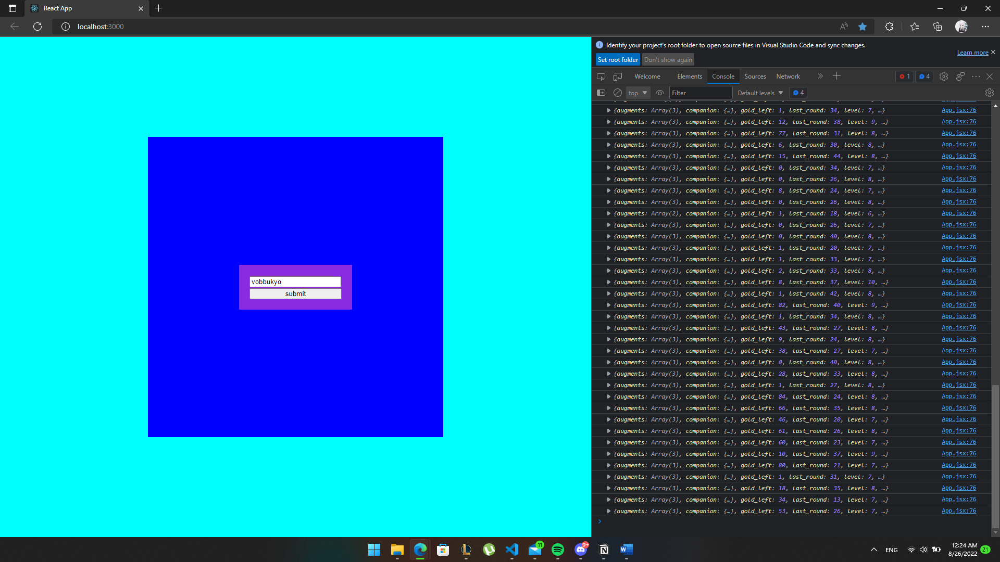

# league_project

This project is a web application that given a summoner's name, find the ongoing game with that ID, and scout on the summoner's opponents' stratagies based on their most recent game plays.
This project uses Riot API, which requires a riot api key. Because this project is still under development, a personal API key is used to make api calls which has some annoying limitations on the rate of requests.

